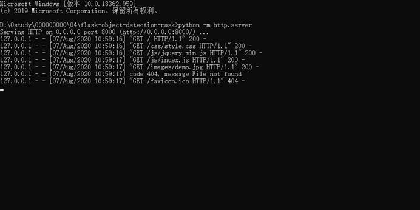
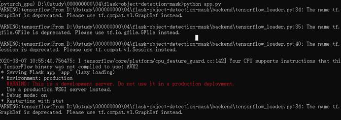
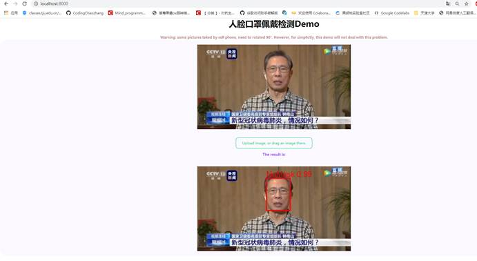
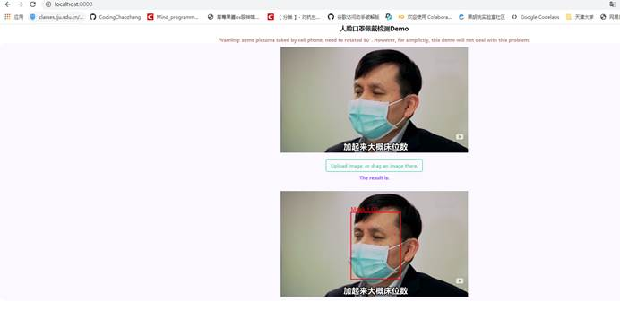

# Python flask 打造前后端分离的口罩检测

整体设计思路是前后端分离，前端就是简单的html css来搭建，前后端交互使用的是jquery中的ajax技术，将前端接受到的图片进行base64编码，之后使用ajax发送到指定的url中，并在done函数添加回调，接受处理返回结果，将json结果 通过canvas控件绘图。后端的话就是使用python编写的轻量级的web框架flask，接受前端发过来的base64编码的图片，并对其解码，转换成PIL的图像对象，使用numpy转成矩阵，以便调用模型来检测检测。

## 前后端分离的口罩检测

- `pyhon -m http.server`

- `python app.py`

 

